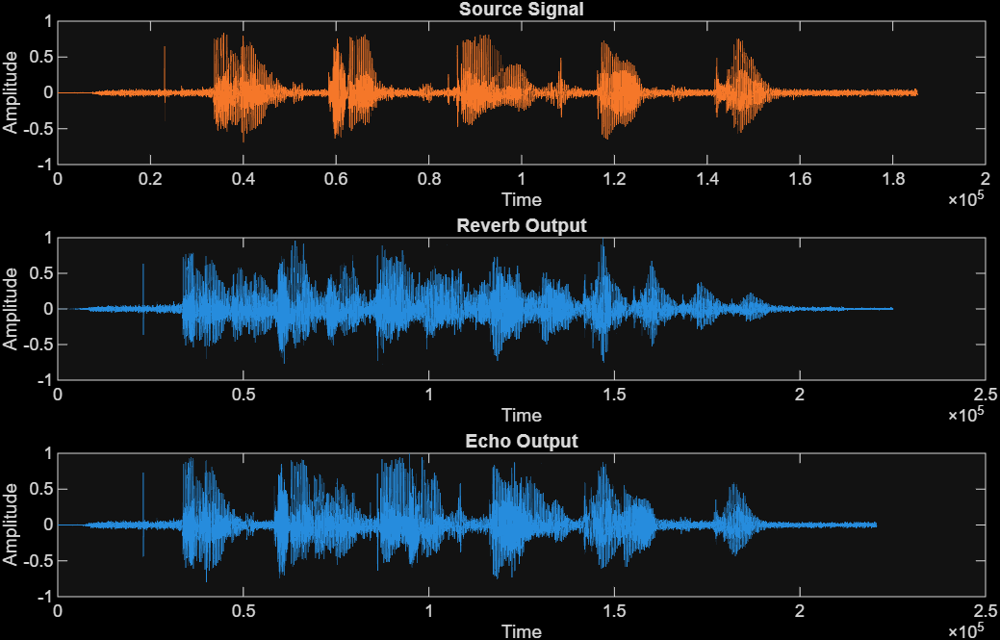
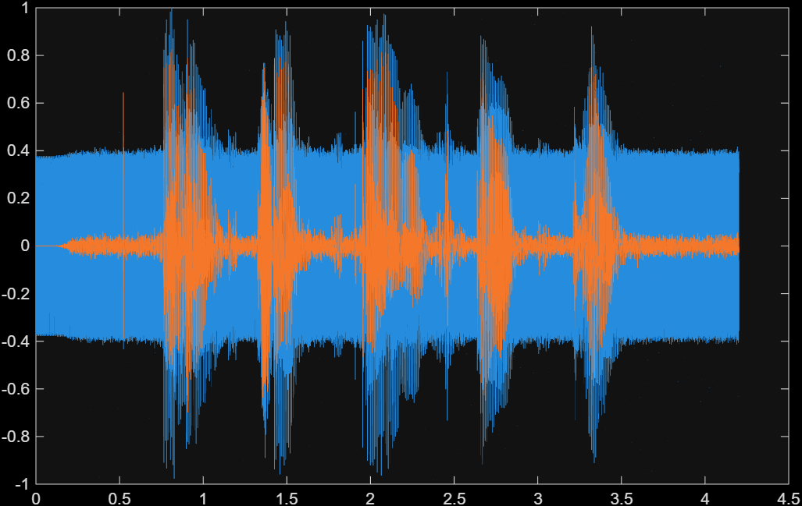
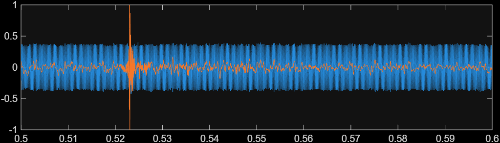
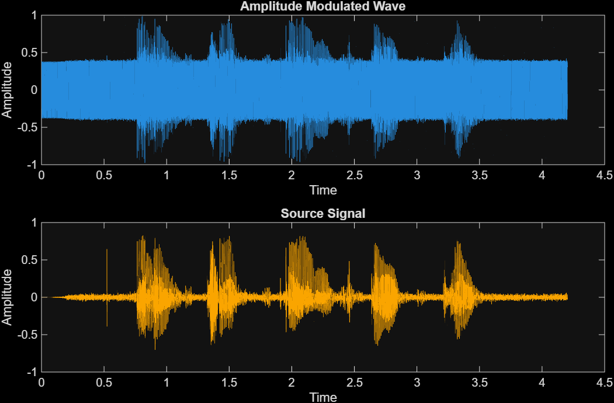
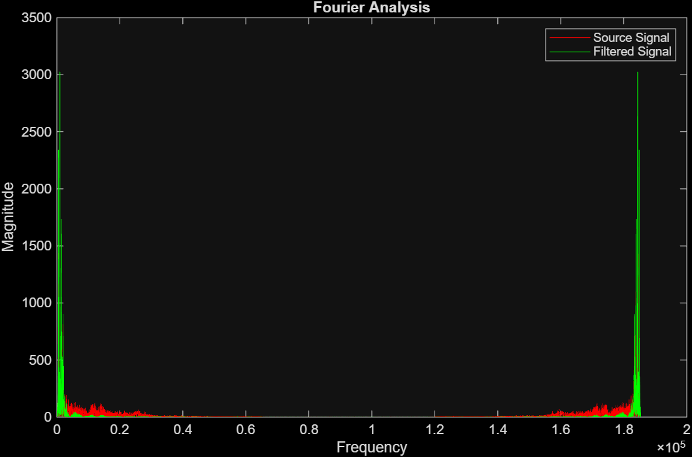
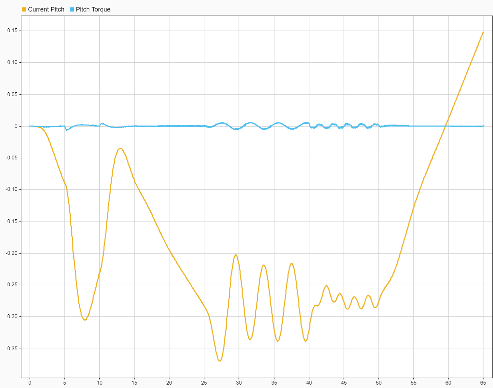
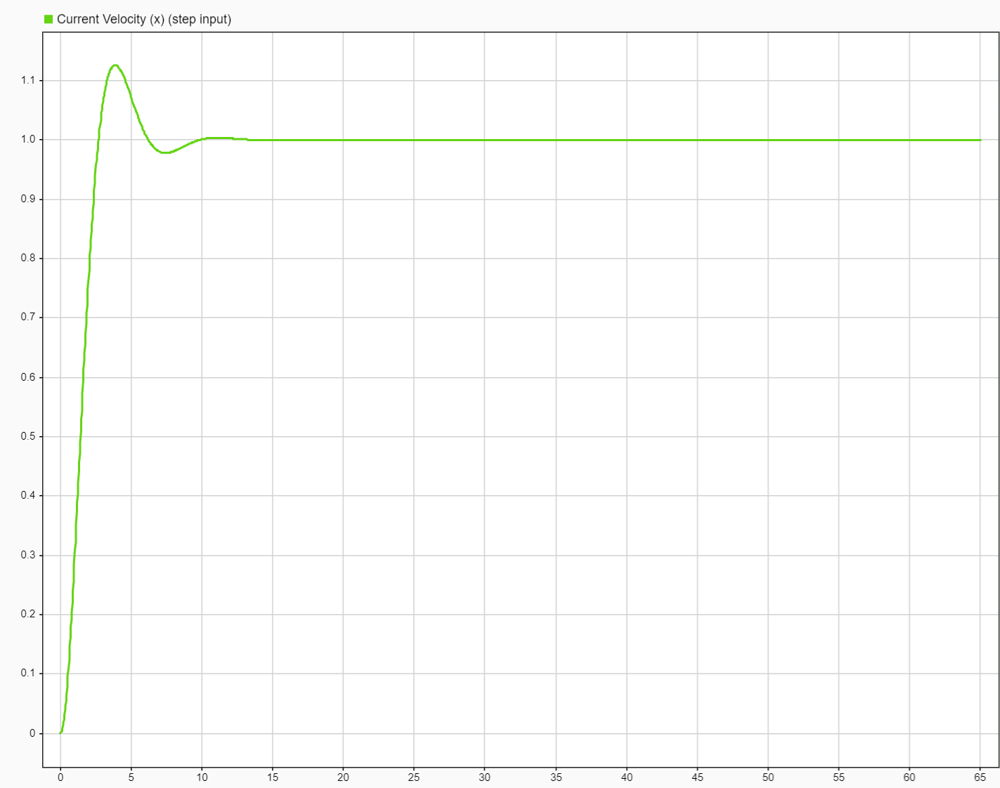

# System Design Architecture

[](https://www.ieee.org/)
[](https://opensource.org/licenses/MIT)
[](https://www.mathworks.com/products/matlab.html)
[](https://www.mathworks.com/products/simulink.html)

A comprehensive framework for mathematical modeling of physical systems, focusing on end-to-end audio signal processing, digital filtering, wave modulation, and the star of the show: a **flight controller for a vision-based helicopter system**. 

This repository conforms strictly to IEEE standards for academic and industrial development. It features a complete pipeline from signal processing in MATLAB to real-time control logic in Simulink and low-level firmware deployment.

---

## Table of Contents

- [Overview](#overview)
- [Repository Structure](#repository-structure)
- [Module 1: Digital Signal Processing](#module-1-digital-signal-processing)
- [Module 2: Vision-Based Helicopter Flight Controller](#module-2-vision-based-helicopter-flight-controller)
- [Module 3: Embedded Hardware and Firmware](#module-3-embedded-hardware-and-firmware)
- [Documentation and Reports](#documentation-and-reports)
- [License](#license)

---

## Overview

This repository demonstrates the integration of complex mathematical models into real-world applications. By simulating physical systems fundamentally (without relying on high-level, black-box abstraction functions), we guarantee precision and robustness suitable for research and enterprise-level applications.

**Note:** This project is being developed as part of an ongoing research initiative at the **Indian Institute of Information Technology (IIIT) Vadodara**, under the mentorship of **Dr. Jignesh Bhatt**.

---

## Repository Structure

The architecture of this project is separated into distinct, highly cohesive domains:

```text
System-Design/
├── assets/          # Images, media, and binary firmware
├── data/            # Raw and processed audio samples
├── docs/            # IEEE Standard Reports, hardware documentation
├── src/
│   ├── esp32_firmware/ # Low-level controller logic (C++)
│   ├── matlab_dsp/     # Mathematical & signal modeling
│   ├── scripts/        # Auxiliary Python scripts
│   └── simulink_models/# Flight controllers (LQR/PID)
└── README.md
```

---

## Module 1: Digital Signal Processing

Located in [src/matlab_dsp/](src/matlab_dsp/), these algorithms simulate the physics of sound and wave transmission using mathematically rigorous techniques.

### Core Features:
- **Audio Effects Simulation**: Time-domain implementation of echo (`audioEcho.m`) and reverberation (`audioReverb.m`).
- **Signal Filtering**: Finite Impulse Response (FIR) implementations via windowing (Hamming). Includes `audioLowPass.m` and `audioHighPass.m`.
- **Modulation Pipeline**: Complete Amplitude Modulation (AM) system mapping baseband signals to a carrier wave.

### Visualization

**1. Echo and Reverb (Time Domain Decay)**  
*Demonstrates the exponential decay tail in the reverb output and distinct secondary impulse in the echo.*


**2. Amplitude Modulation**  
*Displays the high-frequency carrier wave successfully modulated by the time-domain source message signal.*




**3. Frequency Spectrum Analysis (FFT)**  
*Transforms discrete signals to verify the efficacy of the implemented filtering operations in the frequency domain.*


---

## Module 2: Vision-Based Helicopter Flight Controller

Located in [src/simulink_models/](src/simulink_models/), this system features a robust low-level flight controller capable of receiving inputs from a user or a vision-based Reinforcement Learning (RL) model.

The flight controller relies on a dual-loop design:
1. **PID Outer Loop**: Regulates altitude and maps desired velocities into attitude angles (pitch, roll, yaw).
2. **LQR Inner Loop**: 3-axis state feedback utilizing Linear Quadratic Regulators (LQR). It converts angular setpoints and rates ($p, q, r$) into direct control thrusts and torques.

### Output Analytics

**Pitch Torque vs Current Analysis**  


**Velocity Step Response Tracking**  


---

## Module 3: Embedded Hardware and Firmware

Located in [src/esp32_firmware/](src/esp32_firmware/) and [docs/hardware/](docs/hardware/), this section maps theoretical controller logic onto physical devices. 

- **PlatformIO / ESP32**: Real-time evaluation of the inner-loop controllers.
- **Networking Topology**: Thorough experimental records on subnets, routing behaviors, and latency.

---

## Documentation and Reports

Detailed architectural documentation and peer-reviewed style reports are available in the [docs/](docs/) directory:
- **IEEE Research Documents**: PDF files detailing the fundamental calculus and stability criterions (`docs/reports/`).
- **Hardware Experiments**: Detailed logs of custom hardware setups, throughput tests, and firmware hacking attempts (`docs/hardware/routers.md`).

---

## License

This repository is licensed under the MIT License. Academic citations are appreciated when using code models for external publications.
